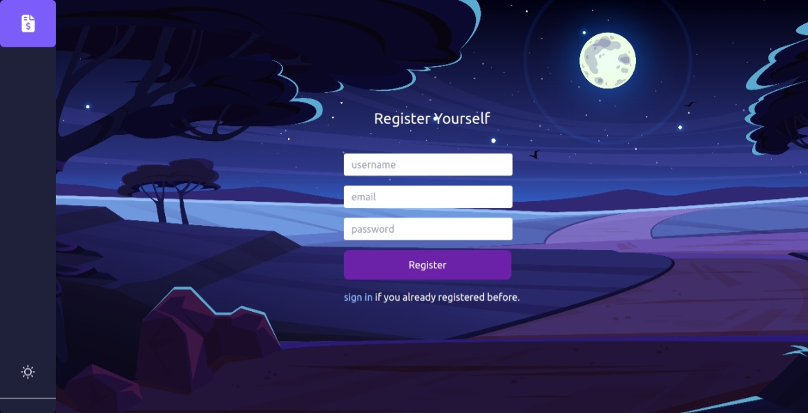
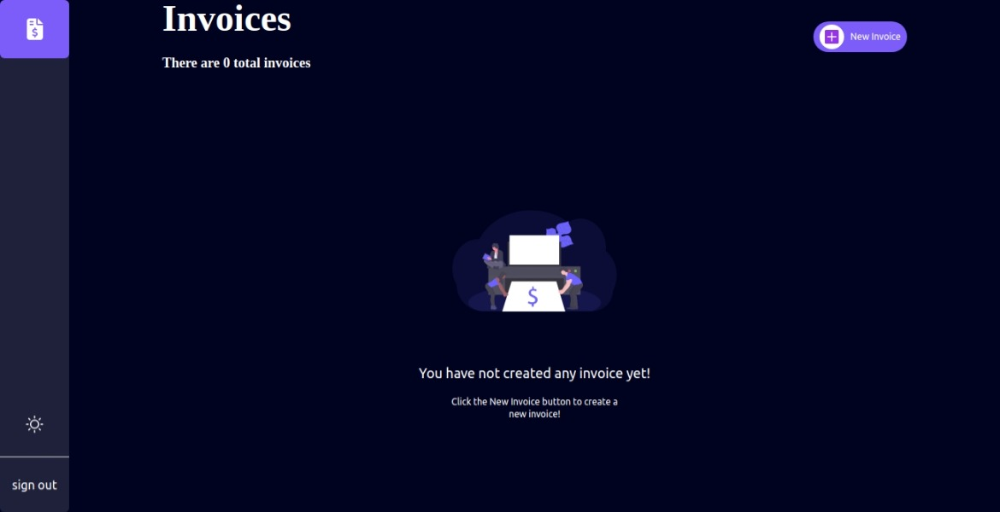
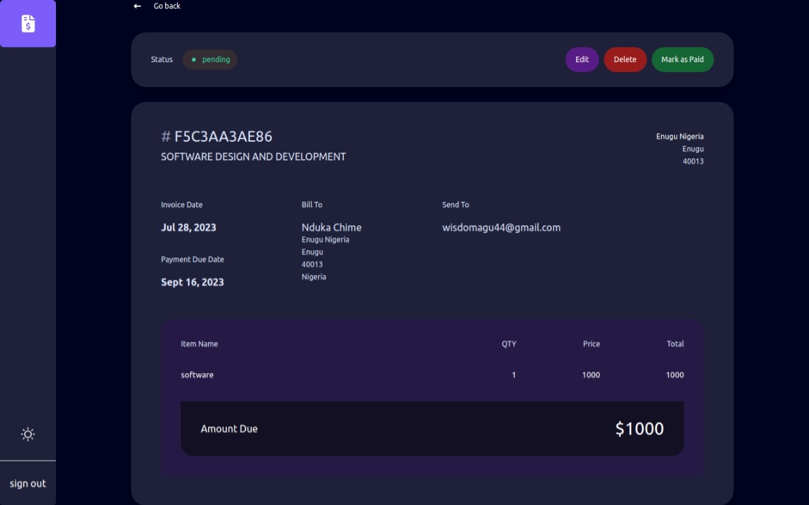

# Invoice App README

Welcome to the Invoice App! This is a detailed guide to help you understand and use the features of our application effectively. The Invoice App is designed to simplify the process of creating, managing, and tracking invoices. Below, you'll find an overview of the app's features and how to use the app.

## Table of Contents

1. [Introduction](#introduction)
2. [Live Site](#invoice App)
3. [Features](#features)
   - [Authentication](#authentication)
   - [Create New Invoice](#create-new-invoice)
   - [Manage Invoice Status](#manage-invoice-status)
   - [Edit and Delete Invoice](#edit-and-delete-invoice)
   - [Dark and Light Mode](#dark-and-light-mode)
   - [Clean User Interface](#clean-user-interface)
4. [Screenshots](#Screenshots)
5. [Usage](#usage)
6. [Future Improvements](#future-improvements)

## Introduction

The Invoice App is a web-based application that allows users to create, manage, and keep track of their invoices efficiently. It offers a clean and intuitive user interface with dark and light mode options for a comfortable user experience.

## Live Site

[Invoice App](https://invoice-app-1gs0.onrender.com/)

## Features

### Authentication

- Secure user authentication system.
- Users can sign up with a unique email address and password.
- Existing users can log in with their credentials.
- Passwords are hashed and stored securely for enhanced security.

### Create New Invoice

- Users can create a new invoice with essential details, such as client information, items, quantities, etc.
- The app will generate a unique invoice ID and date for each new invoice created.
- Invoices can be saved as drafts before they are finalized.

### Manage Invoice Status

- Invoices can be marked with one of three statuses: **Draft**, **Pending**, or **Paid**.
- A draft invoice is not yet ready for submission and can be edited later.
- Pending invoices indicate that payment is expected and are awaiting client action.
- Paid invoices indicate that the payment has been successfully received.

### Edit and Delete Invoice

- Users can edit invoices, updating any information, such as client details, items, and amounts.
- If an invoice is no longer needed, users can delete it from the system.

### Dark and Light Mode

- The app offers both dark and light mode options.
- Users can choose their preferred mode for a personalized viewing experience.

### Clean User Interface

- The app features a clean, intuitive, and user-friendly interface.
- The layout is designed to provide a seamless experience while managing invoices.

## Screenshots

## Usage

1. **Authentication**:
   - Visit the app's URL and sign up with a new account.
   - After you're logged in, refresh the browser if you encounter any weird behaviour, The app is still under development.

2. **Create New Invoice**:
   - After logging in, click on the "New Invoice" button to create a new invoice.
   - Fill in the necessary details, such as client information and itemized items.
   - Save the invoice as a draft or finalize it with the appropriate status.

3. **Manage Invoice Status**:
   - From the list of invoices, you can change the status of each invoice by selecting the appropriate status option.

4. **Edit and Delete Invoice**:
   - To edit an existing invoice, click on the "edit invoice" button on the invoice details page and make the necessary changes.
   - To delete an invoice, click on the "edit invoice" button on the invoice details page.

5. **Dark and Light Mode**:
   - To switch between dark and light mode, look for the mode switch toggle in the app's settings or preferences.

## Future Improvements

The Invoice App is an ongoing project, and we are committed to continuously improving it to provide the best user experience. Here are some future improvements you can expect:

1. **Enhanced Security**: I will continuously work on strengthening the security measures, by ensuring that users can only see their own invoice.

2. **Invoice Templates**: I plan to introduce customizable invoice templates to allow users to create professional-looking invoices with ease. Users will have the option to select from various templates or create their own.

3. **Invoice Reminders**:I will implement an automated reminder system that sends notifications to clients for pending payments, helping users stay on top of their invoicing process.

4. **Invoice History and Audit Trail**: A comprehensive invoice history log will be added to track all changes made to an invoice, ensuring transparency and accountability.

5. **Download as PDF**: Users will have the option to download their invoices as PDF files, making it easy to share and print them.

6. **Payment Gateway Integration**: I plan to integrate popular payment gateways, making it easier for clients to make payments directly through the app.

Bug Fixes and Maintenance:
- Regular updates and bug fixes will be performed to ensure the app's stability and reliability.
- Feedback from users will be valued and addressed promptly to enhance the overall user experience.

Stay tuned for these exciting new features and improvements as I strive to make the Invoice App an even more powerful and user-friendly tool for managing your invoices efficiently!

If you have any suggestions or feature requests, please feel free to share them with Me. I value your input and I'm dedicated to making the Invoice App the best it can be. Thank you for your support!

# The Template for this application is from frontend mentors.

This is a frontend mentor challenge, but I have decided to stretch myself by improving and adding more features to this application.

